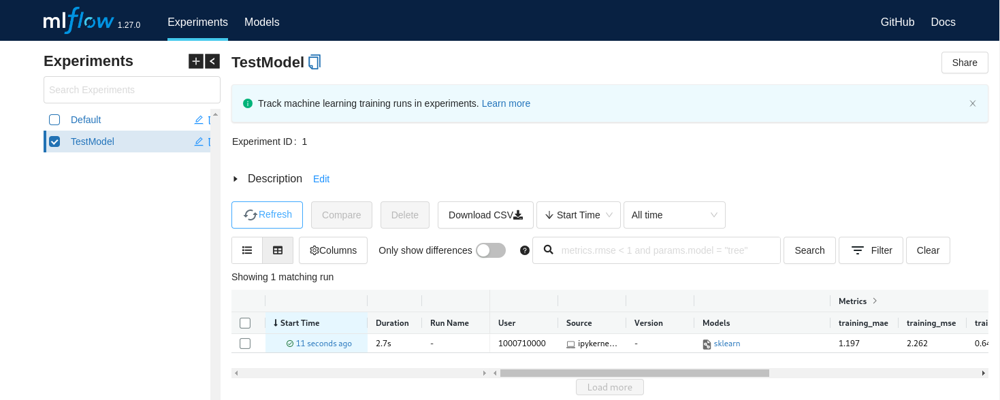
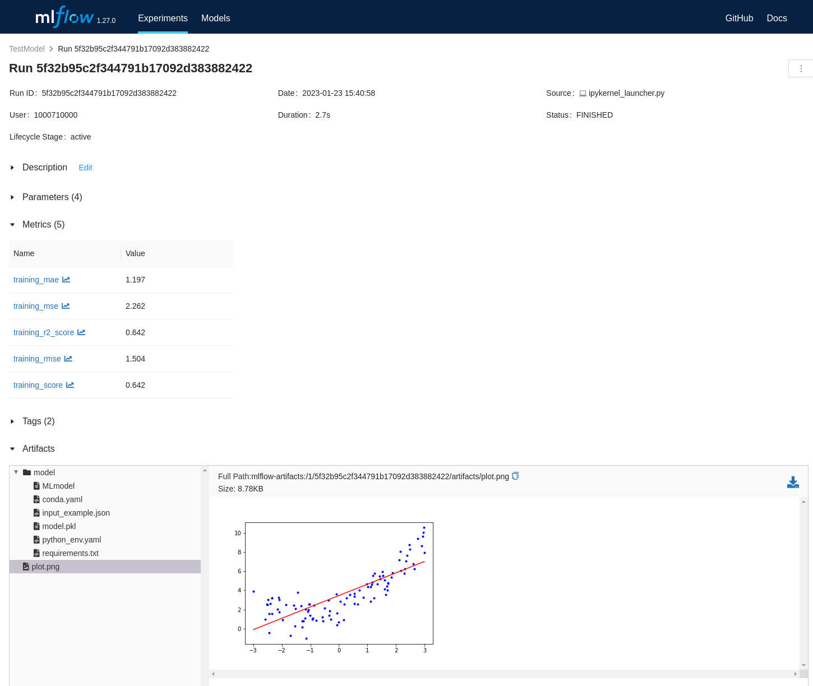
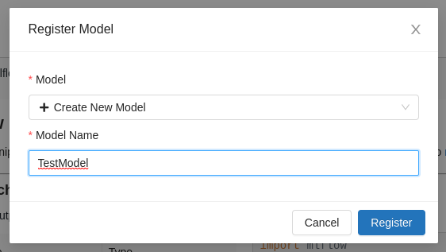
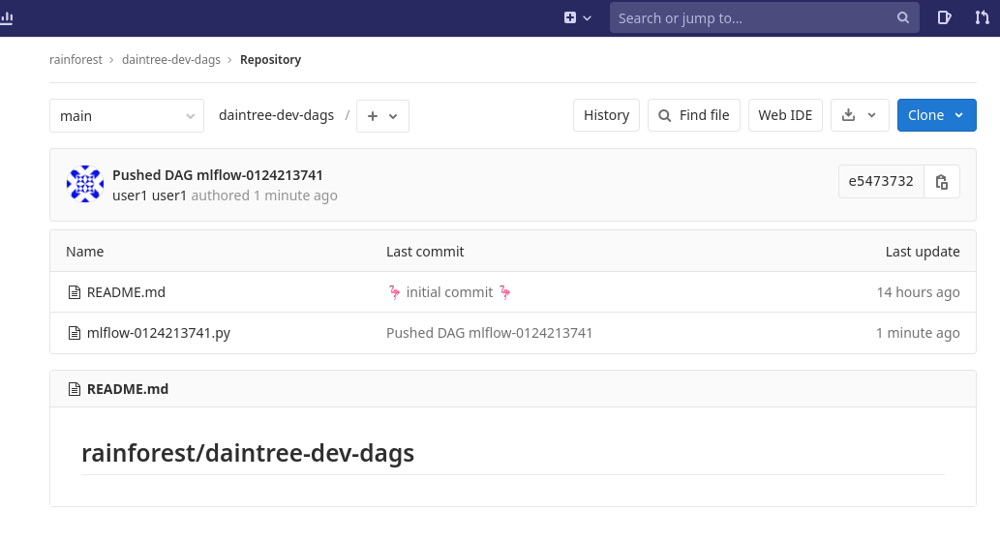
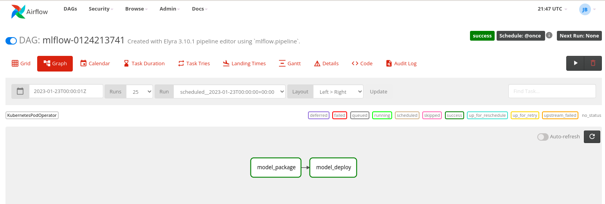
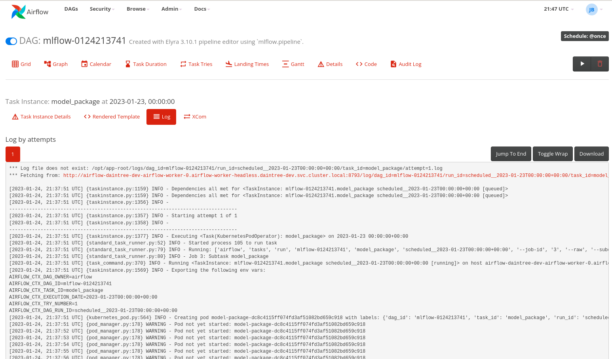
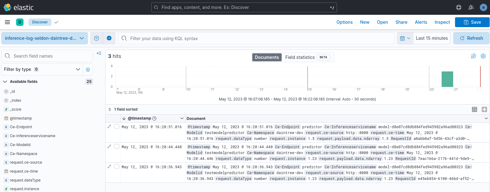

## 𝌭️ Model Pipeline Promotion
## Model pipeline promotion with MLFlow
> mlflow - model lifecycle using a simple regression model, airflow pipeline promotion

1. From the previous exercise, open the **Elyra Notebook Image**.

2. Open **aimlops-demos/mlflow** and Click on the notebook **mlflow.ipynb**

   

3. Install dependencies and follow the notebook instructions. Open MLFlow UI, use the **FreeIPA** identity provider when prompted.

   ```bash
   oc login --server=https://api.${CLUSTER_DOMAIN##apps.}:6443 -u ${USER_NAME} -p ${USER_PASSWORD}
   ```

   ```bash
   echo -e https://$(oc get route mlflow --template='{{ .spec.host }}' -n ${PROJECT_NAME})
   ```

   

4. You can select the model run to observe the model params, as well as see the debug printout in the notebook.

   

5. Use the **model > Register Model** button

   

   to register a model called **TestModel**

   

   and create a **Version1** revision
 
   

6. Open **mlflow.pipeline** and browse the **Properties** for each pipeline node. The name and version of the model we want to deploy are specified as environment variables. The pipeline file dependencies are also listed.

   

7. Trigger Airflow Pipeline by using the **Run Pipeline** triangle button and click **OK**. The airflow pipeline configuration we created earlier should be auto selected.

   

8. Once submitted you should see a popup with links to the **DAG**, **Airflow Run Details** and the artifacts loaded into **S3 Object Storage**.
   
   

9. The **Git Repo** should have the DAG

   

10. Select the Airflow **Run Details** and login to Airflow.

    ```bash
    echo -e https://$(oc get route airflow --template='{{ .spec.host }}' -n ${PROJECT_NAME})
    ```

   Airflow watches the git repo for DAG's and loads them.

   

   You can select the DAG run and look at the graph.

   

   Browse the DAG log for each step in Airflow (Note: this is **not** the actual python step log output - that is stored in s3 logs - see next step to browse with **mc**)

   

11. The DAG step output logs are stored in S3 for each run. We can use the minio client **mc** to look at them. From Jupyterhub terminal.

   ```bash
   AWS_ACCESS_KEY_ID=$(oc get secret s3-auth -n ${PROJECT_NAME} -o jsonpath='{.data.AWS_ACCESS_KEY_ID}' | base64 -d)
   AWS_SECRET_ACCESS_KEY=$(oc get secret s3-auth -n ${PROJECT_NAME} -o jsonpath='{.data.AWS_SECRET_ACCESS_KEY}' | base64 -d)
   ```

   Setup an **mc** alias called **dev**

   ```bash
   mc alias set dev http://minio.${TEAM_NAME}-ci-cd.svc.cluster.local:9000 ${AWS_ACCESS_KEY_ID} ${AWS_SECRET_ACCESS_KEY} 
   ```

   List the buckets under the **dev** alias.

   ```bash
   mc ls dev
   ```

   Some useful commands to look at logs.

   ```bash
   mc ls cat dev/<log name>
   mc ls head/<log name>
   ```

   

12. You can check the build and deployment pods for the run in OpenShift. Because the generated airflow dag uses the Kubernetes Pod Operator, each step is run in a pod. Once successful you should see a compleed build pod and the running Seldon Model pod.

   

13. Once the Seldon model is deployed and running we can check the inference end point using curl from our notebook terminal.

   Get the model http endpoint.

   ```bash
   HOST=$(echo -n https://$(oc -n ${PROJECT_NAME} get $(oc -n ${PROJECT_NAME} get route -l app.kubernetes.io/managed-by=seldon-core -o name) --template='{{ .spec.host }}'))
   ```

   Curl the endpoint with the correct shaped (1d) ndarray.   

   ```bash
   curl -H 'Content-Type: application/json' -H 'Accept: application/json' -X POST $HOST/api/v1.0/predictions -d '{"data": {"ndarray": [[1.23]]}}'
   ```

   Result.

   

14. If you have elastic and the seldon request logger deployed, you can browse to the Request and Response log capture.

   

🪄🪄 Congratulations !! You have now trained, built, deployed and tested your first ML model !! 🪄🪄
